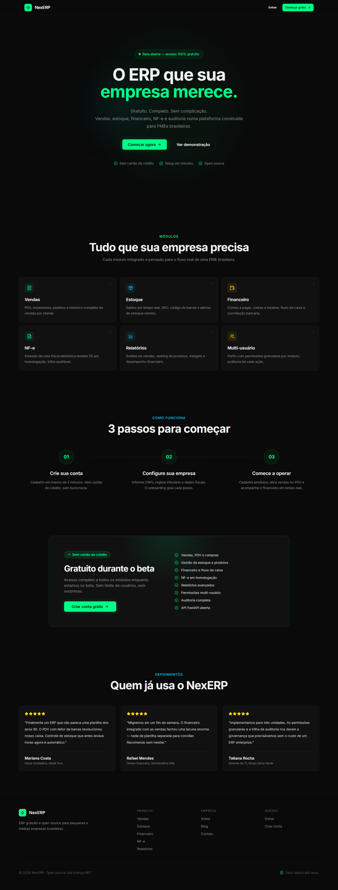
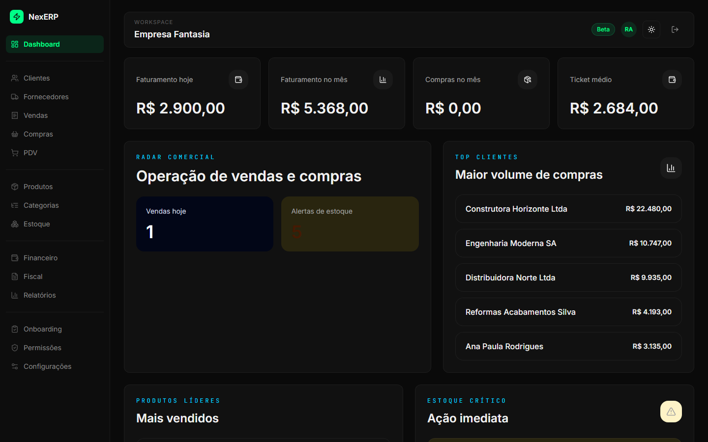
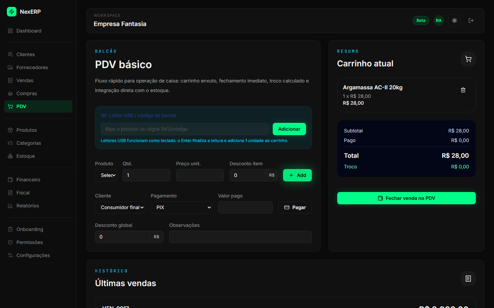
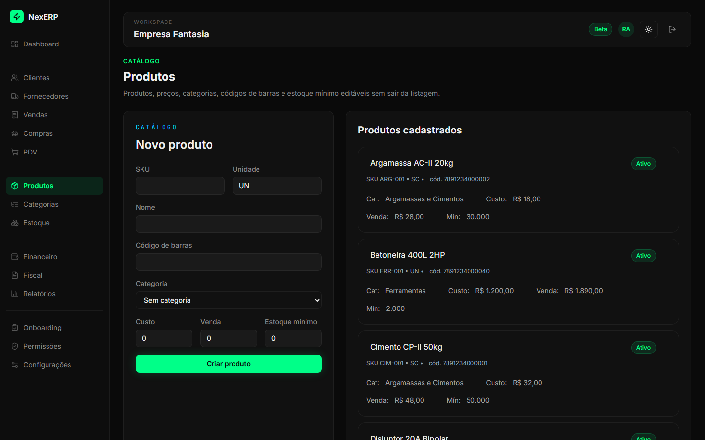
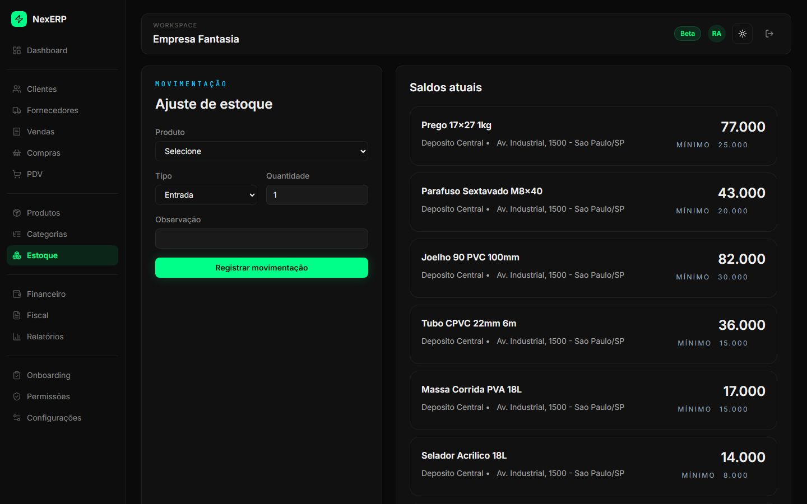
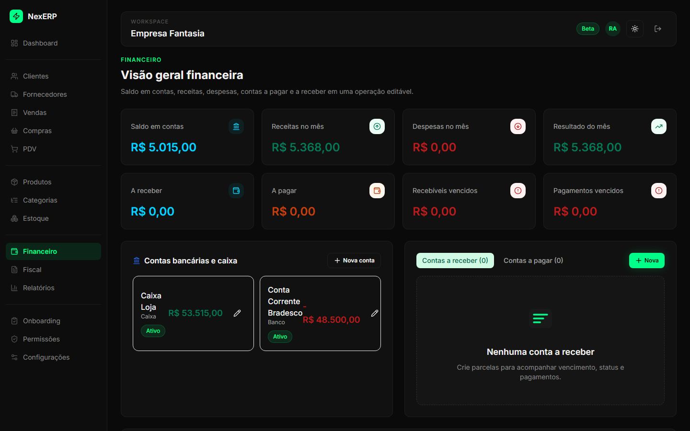
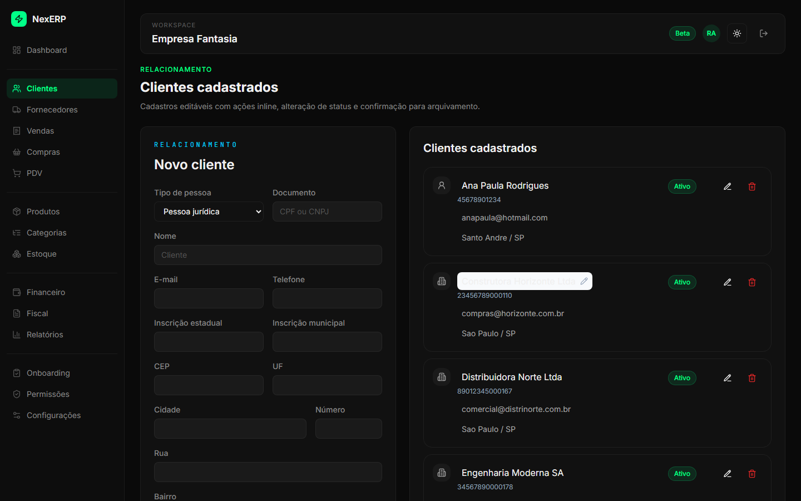
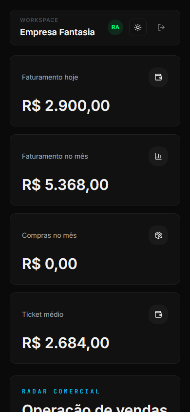

<div align="center">
  

  <h1>NexERP</h1>

  <p><strong>O ERP que sua empresa merece.</strong></p>
  <p>Gratuito. Completo. Sem complicação.</p>

  <p>
    
    
    
    
  </p>

  <p>
    <a href="#-início-rápido">Início Rápido</a> •
    <a href="#-funcionalidades">Funcionalidades</a> •
    <a href="#-screenshots">Screenshots</a> •
    <a href="#-stack">Stack</a> •
    <a href="#-contribuindo">Contribuindo</a>
  </p>
</div>

---

## O que é o NexERP?

NexERP é um sistema ERP open source feito para pequenas e médias empresas brasileiras. Setup em um comando, interface moderna, 100% em português, com validação nativa de CPF, CNPJ, CEP e emissão de NF-e.

Chega de pagar caro por sistema feio e difícil de usar.

---

## ✨ Funcionalidades

| Módulo | Descrição |
|--------|-----------|
|  **PDV** | Frente de caixa com leitor de código de barras |
|  **Estoque** | Controle de entrada, saída e múltiplos depósitos |
|  **Clientes** | Cadastro completo com histórico de compras |
|  **Financeiro** | Contas a pagar/receber, fluxo de caixa |
|  **NF-e** | Emissão integrada com SEFAZ |
|  **Dashboard** | KPIs em tempo real, ranking, alertas |
|  **Permissões** | Controle granular por usuário |
|  **Auditoria** | Log completo de todas as ações |
|  **Relatórios** | Exportação em PDF e Excel |
|  **Multi-empresa** | Uma instalação, várias empresas |

---

##  Início Rápido

**Pré-requisitos:** Docker e Docker Compose instalados.

```bash
# 1. Clone o repositório
git clone https://github.com/spy-exe/nexerp.git
cd nexerp

# 2. Configure as variáveis de ambiente
cp .env.example .env

# 3. Gere uma SECRET_KEY segura e cole no .env
python -c "import secrets; print(secrets.token_hex(32))"

# 4. Suba o sistema
docker compose up -d

# 5. Acesse
# Frontend: http://localhost:3000
# API docs: http://localhost:8000/docs
```

Pronto. Crie sua empresa no primeiro acesso e comece a usar.

---

##  Screenshots

### Dashboard


### PDV — Ponto de Venda


### Produtos


### Estoque


### Financeiro


### Clientes


### Painel Administrativo


<details>
<summary>Ver mais screenshots</summary>

### Mobile


</details>

---

## ️ Stack

**Backend**
- Python 3.12 + FastAPI
- SQLAlchemy 2.x async + Alembic
- PostgreSQL 16 + Redis + Celery

**Frontend**
- Next.js 15 + TypeScript
- Tailwind CSS + shadcn/ui
- React Query + Zustand + Zod

**Infra**
- Docker + Docker Compose
- Caddy (SSL automático)
- GitHub Actions (CI/CD)

---

##  Segurança

- JWT com refresh token rotativo (HttpOnly cookie)
- bcrypt custo 12 para senhas
- Rate limiting por IP (Redis)
- Validação Pydantic v2 em todas as entradas
- Row Level Security por empresa (multi-tenant)
- Headers de segurança: HSTS, CSP, X-Frame-Options
- Log de auditoria completo

---

##  Estrutura do Projeto

```
nexerp/
├── backend/           # FastAPI + Python
│   ├── app/
│   │   ├── api/       # Endpoints
│   │   ├── services/  # Regras de negócio
│   │   ├── models/    # SQLAlchemy models
│   │   └── core/      # Config, auth, db
│   └── migrations/    # Alembic
├── frontend/          # Next.js 15
│   ├── app/           # App Router
│   ├── components/    # Componentes
│   └── lib/           # Utilitários
├── docs/
│   └── screenshots/   # Screenshots do sistema
└── docker-compose.yml
```

---

## ️ Roadmap

- [x] Autenticação e onboarding
- [x] Produtos e estoque
- [x] Vendas e PDV
- [x] Compras
- [x] Financeiro completo
- [x] NF-e (homologação)
- [x] Relatórios com exportação
- [x] Painel administrativo SaaS
- [x] Telemetria e feedback
- [ ] App mobile (React Native)
- [ ] Integração PIX
- [ ] NF-e produção certificada
- [ ] Marketplace de integrações

---

##  Contribuindo

Contribuições são muito bem-vindas. Leia o [CONTRIBUTING.md](CONTRIBUTING.md) antes de abrir um PR.

```bash
# Fork → clone → branch → PR para develop
git checkout -b feature/minha-feature
git commit -m "feat: minha contribuição"
git push origin feature/minha-feature
```

---

##  Licença

MIT License — use, modifique e distribua livremente.
Feito no Brasil  por [Ricardo Figueiredo](https://github.com/spy-exe)

---

<div align="center">
  <sub>Se o NexERP te ajudou, deixa uma ⭐ no repositório.</sub>
</div>
