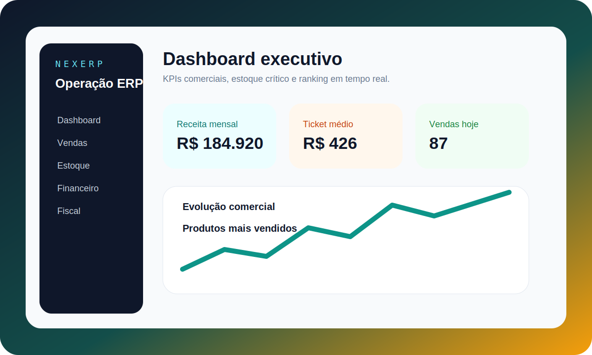
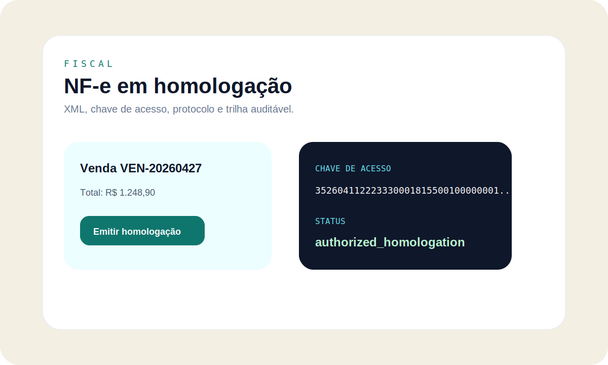
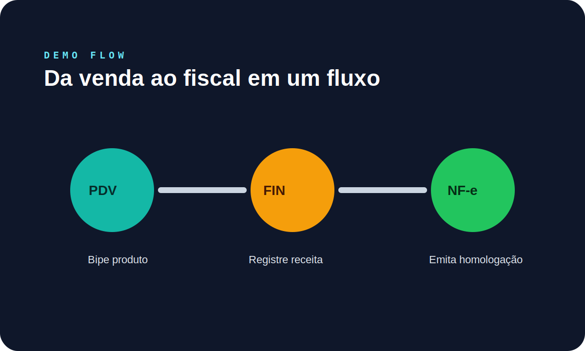

# NexERP

> ERP open source para pequenas e médias empresas brasileiras.

NexERP entrega uma base completa para operar comercial, estoque, financeiro, fiscal em homologação, permissões e auditoria com setup local simples.



## Características

- 100% em português
- Setup com Docker Compose
- Multi-tenant com `company_id` e Row Level Security no PostgreSQL
- Autenticação JWT com refresh token rotativo
- Clientes, fornecedores, produtos, estoque, vendas, compras e PDV
- Financeiro com contas, transações, contas a pagar/receber, fluxo de caixa e exportações PDF/Excel
- NF-e modelo 55 em ambiente de homologação
- Permissões granulares por módulo e log de auditoria
- Relatórios avançados e dashboard com KPIs

## Stack

| Camada | Tecnologia |
| --- | --- |
| Backend | FastAPI + Python 3.12 |
| Frontend | Next.js 15 + TypeScript |
| Banco de dados | PostgreSQL 16 |
| Cache/Filas | Redis + Celery |
| Proxy | Caddy |
| Container | Docker + Docker Compose |
| Testes | Pytest + Vitest-ready + Locust |

## Screenshots



## Demo



## Início Rápido

```bash
git clone https://github.com/spy-exe/nexerp.git
cd nexerp
cp .env.example .env
docker compose up -d
```

Acesse:

- Frontend: `http://localhost:3000`
- API docs: `http://localhost:8000/docs`
- Health check: `http://localhost:8000/api/v1/health`

## Validação Local

Backend:

```bash
cd backend
.venv\Scripts\python.exe -m ruff check .
.venv\Scripts\python.exe -m pytest
```

Frontend:

```bash
cd frontend
npm run type-check
npm run lint
npm run build
```

## Documentação

- [Arquitetura](docs/architecture.md)
- [OpenAPI](docs/openapi.md)
- [Segurança](docs/security.md)
- [Testes de carga](docs/load-testing.md)
- [Contribuindo](CONTRIBUTING.md)

## Fiscal

A integração NF-e está preparada para ambiente de homologação primeiro. O fluxo atual gera XML, chave de acesso, protocolo controlado, endpoint oficial SEFAZ/SP de homologação e auditoria. Para produção real, configure certificado A1/A3 e substitua o adaptador de homologação pelo cliente SOAP certificado.

## Licença

MIT License - veja [LICENSE](LICENSE) para detalhes.
